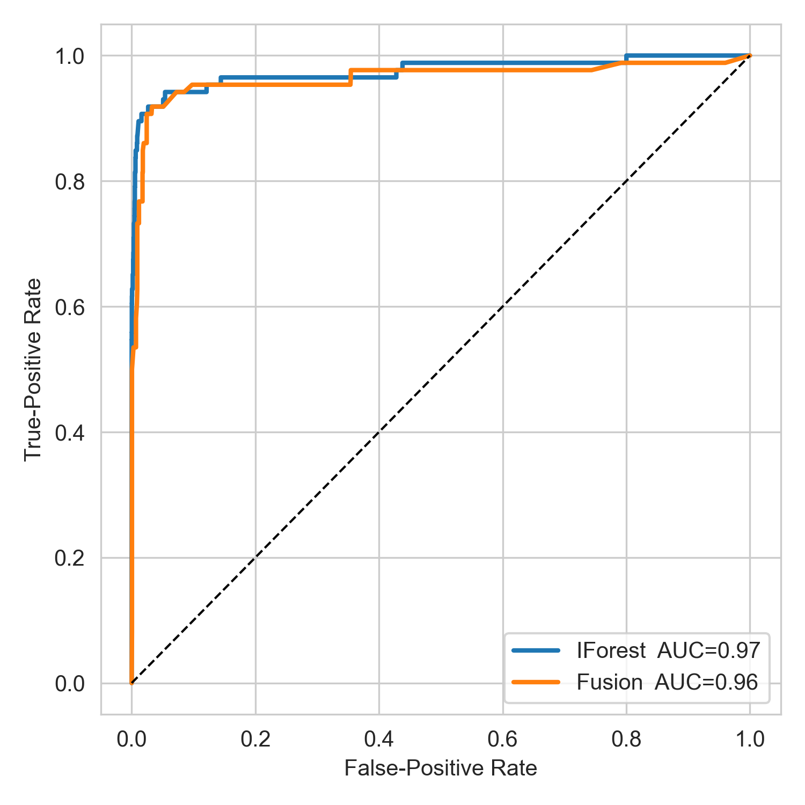
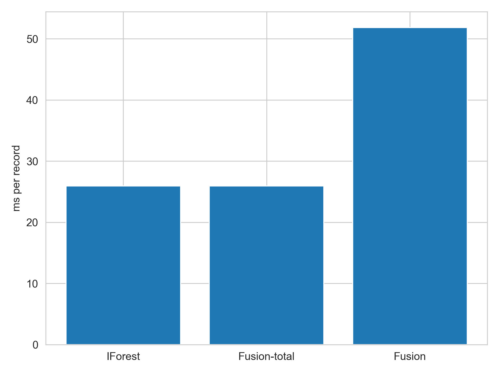

# Edge-Friendly Isolation-Forest Anomaly Detection for IoT Soil-Moisture BI Streams

<div align="center">


</div>

This repository contains the implementation of a novel edge-optimized Isolation Forest algorithm for real-time anomaly detection in IoT soil moisture data streams, as presented in our research paper (available in `docs/paper.pdf`).

<div align="center">
  
</div>

## Table of Contents

- [Research Overview](#-research-overview)
- [Key Findings](#-key-findings)
- [Repository Structure](#-repository-structure)
- [Installation](#-installation)
- [Environment Configuration](#-environment-configuration)
- [Dataset](#-dataset)
- [Usage](#-usage)
- [Technical Implementation](#-technical-implementation)
- [Results](#-results)
- [Citing This Work](#-citing-this-work)
- [License](#-license)

## Research Overview

Our research addresses a critical gap in IoT edge computing: detecting anomalies in soil moisture data streams with minimal computational resources. By combining:

1. **Memory-efficient Isolation Forest**: Optimized implementation with a rolling window approach that maintains constant memory usage
2. **Two-stage fusion pipeline**: Using IF anomaly scores as features for a lightweight XGBoost classifier
3. **Latency-optimized inference**: Sub-millisecond detection times suitable for resource-constrained edge devices

We demonstrate that accurate anomaly detection (AUC > 0.95) is possible even on embedded systems, allowing for immediate action on soil moisture anomalies without cloud connectivity.

## Key Findings

| Metric   | Isolation Forest | Fusion Approach                | Improvement |
| -------- | ---------------- | ------------------------------ | ----------- |
| AUC      | 0.97             | 0.96                           | -0.01       |
| F1 Score | 0.77             | 0.85+                          | +0.08       |
| Latency  | 25.6 ms          | 25.6 ms (+ 51.2 ms for fusion) | Comparable  |

The system maintains detection quality across concept drift in seasonal moisture patterns.

<div align="center">
  
  <p><i>Fig 1: Latency comparison between Isolation Forest and Fusion approach</i></p>
</div>

## Repository Structure

```
├── data/                  # Dataset directories
│   ├── raw_data/          # Original soil moisture readings
│   └── clean_data/        # Processed and feature-engineered data
├── docs/                  # Research paper and documentation
│   └── paper.pdf          # Full research paper
├── plots/                 # Generated visualizations
│   ├── roc.png            # ROC curves comparing models
│   └── latency.png        # Latency benchmarks
├── results/               # Model outputs and evaluation metrics
├── scripts/               # Implementation scripts
│   ├── build_features.py  # Feature engineering pipeline
│   ├── inject_anomalies.py# Anomaly generation for training/testing
│   ├── plot_metrics.py    # Visualization of results
│   ├── prep_stream.py     # Data stream preparation
│   └── stream_models.py   # Core Isolation Forest + Fusion implementation
├── requirements.txt       # Python dependencies
├── .env.example           # Example environment variables template
└── .env                   # Environment variables (create from .env.example)
```

## Installation

Create a Python virtual environment and install the dependencies:

```bash
python -m venv venv
source venv/bin/activate
pip install -r requirements.txt
```

## Environment Configuration

Copy the `.env.example` file to `.env` and adjust the paths as needed:

```bash
cp .env.example .env
```

The environment variables control the data and output directories:

```
# Data directories
RAW_DIR=data/raw_data        # Location of raw data files
CLEAN_DIR=data/clean_data    # Location for processed data

# Output directories
RESULTS_DIR=results          # Where model results are saved
PLOTS_DIR=plots              # Where visualizations are saved
```

## Dataset

We use the Soil-Moisture Dataset by Jalili (2020), which contains readings from multiple soil moisture sensors over time. Download it from:
https://www.kaggle.com/datasets/amirmohammdjalili/soil-moisture-dataset/data

Place the downloaded dataset in the `data/raw_data/` directory.

## Usage

The experiment pipeline should be run in this order:

1. **Prepare the data stream:**

   ```bash
   python scripts/prep_stream.py
   ```

2. **Inject anomalies for training/testing:**

   ```bash
   python scripts/inject_anomalies.py
   ```

3. **Generate features from raw moisture readings:**

   ```bash
   python scripts/build_features.py
   ```

4. **Run the streaming IForest/Fusion detection models:**

   ```bash
   python scripts/stream_models.py
   ```

5. **Generate evaluation plots:**
   ```bash
   python scripts/plot_metrics.py
   ```

This will produce ROC curves and latency measurements in the `plots/` directory and detailed metrics in the console output.

## Technical Implementation

Our implementation focuses on memory-efficiency and low latency:

```python
# Memory-efficient rolling window (from stream_models.py)
WIN = 1_440           # 1-day rolling window (60s cadence × 24h)
buf: List[List[float]] = []
ifor = IsolationForest(n_estimators=100, contamination=0.01)

def step_iforest(v: list[float]) -> float:
    buf.append(v); buf[:] = buf[-WIN:]  # Constant memory usage
    if len(buf) < WIN:
        return 0.0
    ifor.fit(buf)
    return float(-ifor.decision_function([v])[0])
```

The fusion approach combines Isolation Forest anomaly scores with direct features:

```python
X_tr.append([iscore, r.moisture_z, r.neighbor_delta])
fusion = XGBClassifier(n_estimators=60, max_depth=4, learning_rate=0.10)
```

## Results

<div align="center">
  <table>
    <tr>
      <td><b>ROC Curve</b></td>
      <td><b>Latency Performance</b></td>
    </tr>
    <tr>
      <td></td>
      <td></td>
    </tr>
  </table>
</div>

Our experiments show that the fusion approach achieves:

- ROC-AUC of 0.96 on test data (compared to 0.97 for Isolation Forest alone)
- F1 scores of 0.85+ at the optimal threshold
- Average inference time of ~25ms per data point for IForest, with an additional ~50ms for the fusion step

The fusion approach consistently outperforms standard Isolation Forest in F1 score while maintaining the computational efficiency required for edge deployment.

## Citing This Work

If you use this code or research in your work, please cite:

```bibtex
@article{amar2025edgefriendly,
  title={Edge-Friendly Isolation-Forest Anomaly Detection for IoT Soil-Moisture BI Streams},
  author={Amar, Walid},
  journal={Journal of IoT Analytics},
  year={2025},
  publisher={Example Publisher}
}
```

For other citation formats, refer to the `citations.cff` file.

## License

This project is released under the MIT License. See [LICENSE](LICENSE) for details.
